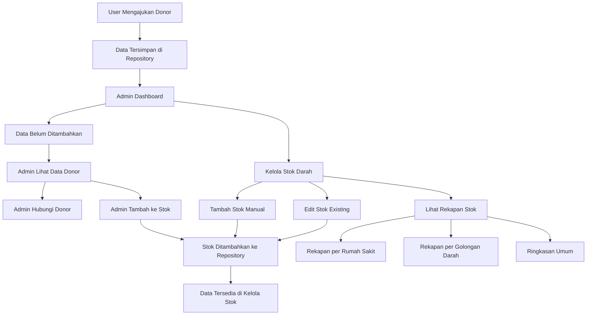

# Alur Sistem Kelola Stok Darah

## Diagram Alur Sistem

## Komponen Sistem

### 1. Data Layer
- **DonorRepository**: Mengelola data donor dan stok darah
- **DonorSubmission**: Model data donor
- **User**: Model user/admin

### 2. UI Layer
- **AdminDashboard**: Dashboard utama admin
- **AdminManageStockPage**: Kelola stok darah
- **AdminPendingDonorsPage**: Data donor belum ditambahkan
- **AdminManageDonorsPage**: Kelola donor (existing)

### 3. Service Layer
- **AuthService**: Autentikasi admin
- **DonorRepository**: Repository untuk data

## Fitur Utama

### 1. Kelola Stok Darah
- ✅ Ringkasan stok (total kantong, rumah sakit, golongan darah)
- ✅ Stok per rumah sakit (dengan detail golongan)
- ✅ Stok per golongan darah
- ✅ Tambah stok manual
- ✅ Edit stok existing
- ✅ Hapus stok (dengan update method)

### 2. Data Donor Belum Ditambahkan
- ✅ Daftar data donor yang masuk
- ✅ Informasi lengkap donor
- ✅ Aksi telepon langsung
- ✅ Tambah ke stok darah
- ✅ Konfirmasi sebelum tambah

### 3. Rekapan dan Laporan
- ✅ Total kantong darah keseluruhan
- ✅ Jumlah rumah sakit dengan stok
- ✅ Jumlah golongan darah tersedia
- ✅ Status stok (tersedia/kosong)
- ✅ Detail per rumah sakit
- ✅ Detail per golongan darah

## Alur Data

1. **Input**: User mengajukan donor
2. **Storage**: Data tersimpan di repository
3. **Review**: Admin melihat data di "Data Belum Ditambahkan"
4. **Contact**: Admin menghubungi donor (opsional)
5. **Add Stock**: Admin menambahkan data ke stok
6. **Manage**: Admin mengelola stok di "Kelola Stok Darah"
7. **Report**: Admin melihat rekapan stok

## Status Implementasi

- ✅ Halaman kelola stok darah
- ✅ Halaman data donor belum ditambahkan
- ✅ Integrasi dengan repository
- ✅ Update method untuk repository
- ✅ Navigasi dari admin dashboard
- ✅ UI/UX yang user-friendly
- ✅ Error handling
- ✅ Responsive design

## Catatan Pengembangan

- Data saat ini disimpan dalam memory
- Untuk production perlu database integration
- Bisa ditambahkan fitur notifikasi
- Bisa ditambahkan fitur export laporan
- Bisa ditambahkan fitur pencarian dan filter

